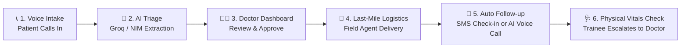
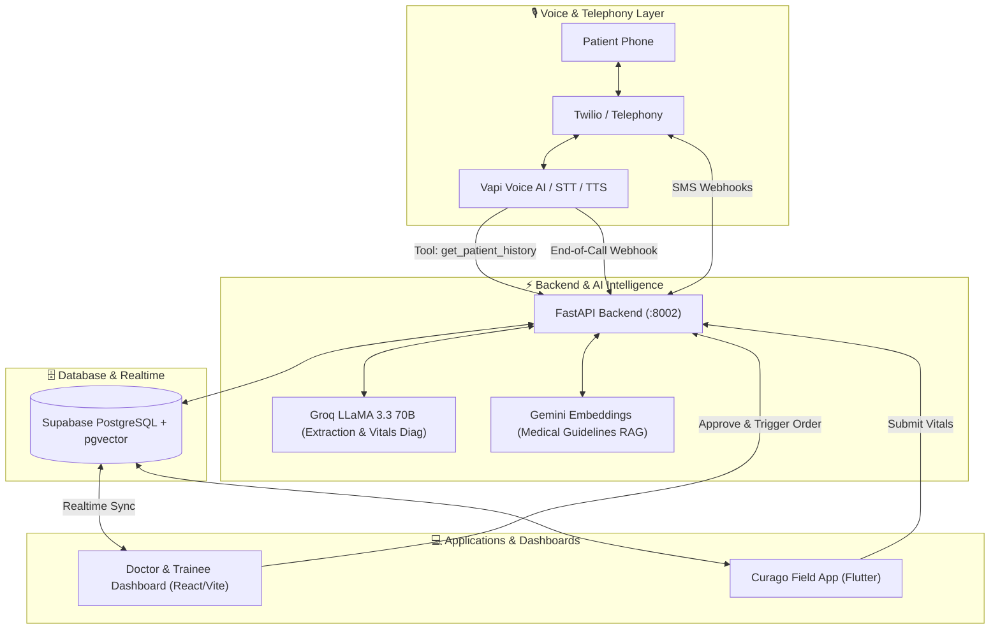

# 🏥 Curago — Phygital Telemedicine & Rural Healthcare Logistics

[](https://fastapi.tiangolo.com/)
[](https://reactjs.org/)
[](https://supabase.com/)
[](https://flutter.dev/)
[](https://groq.com/)

> **Curago** is an end-to-end "Phygital" (Physical + Digital) healthcare platform built to bring primary healthcare, intelligent voice triage, real-time doctor oversight, and last-mile medicine delivery to rural and underserved communities.

---

## 🌟 The 4-Phase Care Delivery Flow



### 1. 🎙️ Multilingual Voice AI Intake
- Patients call a single toll-free helpline.
- Powered by **Vapi / Twilio / Sarvam AI / Groq LLaMA 3.3 70B**.
- Speaks and understands regional languages (Marathi, Hindi, English).
- Cross-examines patients sequentially (symptoms, duration, age, village) and detects emergency severity.

### 2. 📋 Realtime Doctor & Trainee Dashboard
- **Instant Triage Queue**: Incoming patient tickets populate in real-time via **Supabase Realtime**.
- **AI-Recommended Medicines**: Suggests prescriptions matched to available local inventory (L1/L2 stock).
- **One-Click Approval & Dispatch**: Doctors can approve prescriptions, adjust dosages, or trigger an instant call-back.
- **Specialist Camp Escalation**: Severe or unresolvable cases are directly escalated to upcoming physical specialist health camps.

### 3. 🛵 Last-Mile Delivery (Flutter Field App)
- Field agents and village trainees receive approved prescription dispatch orders.
- Dynamic inventory routing:
  - **L1 (Village Level)**: Common over-the-counter and essential medicines.
  - **L2 (Cluster Level)**: Temperature-sensitive or advanced medicines.
  - **L3 (District Level)**: Specialized therapeutics.
- Built-in payment collection (Cash, Pre-paid, Digital QR).

### 4. 🔄 Resolution & Automated Safety Net
- **SMS Follow-ups**: Automated SMS triggers verify recovery. If the patient replies "NO", a trainee is auto-assigned for an in-person vitals check.
- **Context-Aware AI Calls**: Patients calling the helpline for follow-ups are identified. Vapi queries the `get_patient_history` tool so the AI dynamically remembers their past symptoms.
- **Vitals Escalation**: When a trainee inputs patient vitals via the Field App, Groq AI diagnoses the severity. If critical, the ticket is instantly escalated back to **doctor_review** on the Doctor Dashboard.

---

## 🏗️ Architecture



---

## 📂 Repository Structure

```text
curago/
├── backend/                  # FastAPI Python Backend
│   ├── app/
│   │   ├── core/             # Supabase & environment configuration
│   │   ├── routers/          # Webhooks, Doctor, Trainee, Orders endpoints
│   │   └── services/         # LLM extraction, Gemini RAG, SMS services
│   ├── main.py               # Application entry point
│   ├── total_monitor.py      # Real-time webhook & database diagnostic monitor
│   └── requirements.txt      # Python dependencies
│
├── frontend/                 # React 18 + Vite Web Application
│   ├── src/
│   │   ├── pages/            # DoctorDashboard, TraineeDashboard, LoginLanding
│   │   └── lib/              # Supabase client & state management
│   ├── package.json
│   └── vite.config.js
│
├── curago_field_app/         # Flutter Mobile Application
│   ├── lib/                  # Delivery management & payment screens
│   └── pubspec.yaml
│
└── docs/                     # Architecture diagrams & technical specifications
```

---

## 🚀 Quickstart & Local Setup

### Prerequisites
- **Python 3.10+**
- **Node.js 18+** & `npm`
- **Flutter SDK** (for the delivery app)
- **Supabase Account** & **Groq / OpenAI API Keys**

---

### 1. Backend Setup

```powershell
cd backend

# Create & activate virtual environment
python -m venv venv
.\venv\Scripts\Activate.ps1   # On Windows
# source venv/bin/activate    # On Linux/macOS

# Install dependencies
pip install -r requirements.txt

# Create .env file with your credentials
# (SUPABASE_URL, SUPABASE_KEY, GROQ_API_KEY, GEMINI_API_KEY, etc.)

# Start FastAPI server
uvicorn app.main:app --port 8002 --reload
```

---

### 2. Frontend Setup (Doctor & Trainee Dashboard)

```powershell
cd frontend

# Install dependencies
npm install

# Start Vite dev server
npm run dev
```
Open **[http://localhost:5173](http://localhost:5173)** in your browser.

#### Demo Credentials:
| Role | Email | Password |
| :--- | :--- | :--- |
| **Doctor** | `doctor@curago.com` | `Password123!` |
| **Trainee** | `trainee@curago.com` | `Password123!` |

---

### 3. Curago Field Mobile App (Flutter)

```powershell
cd curago_field_app

# Get dependencies
flutter pub get

# Run on emulator / connected device
flutter run
```

---

### 4. Realtime Diagnostic Monitor

To monitor live voice webhook payloads, Groq data extractions, and Supabase ticket creation in real-time:

```powershell
cd backend
python total_monitor.py
```

---

## 🔒 Security & Privacy

- **Data Isolation**: Patient identifiable information (PII) is encrypted and access-controlled through Supabase Row-Level Security (RLS).
- **Environment Safety**: All API keys, database credentials, and session tokens are strictly managed via environment variables and excluded from version control.

---

## 📄 License
This project was developed for healthcare hackathon demonstration purposes.
