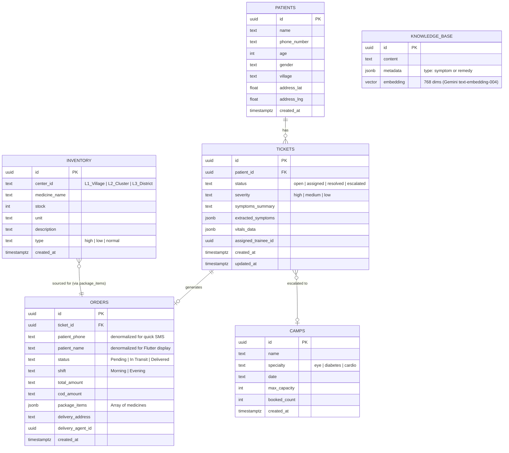

# Entity Relationship (ER) Diagram

This represents the complete database schema for V2, supporting the React Dashboard, the Flutter LastMileAgent app, the RAG knowledge base, and the specialist camp escalation flow.

