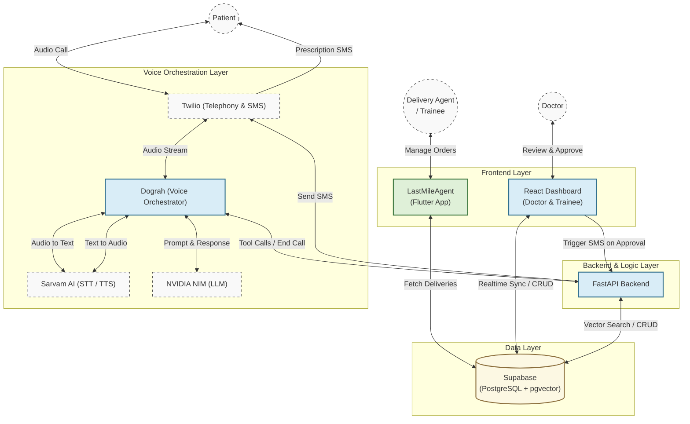

# High-Level Design (HLD)

This diagram shows the high-level components of the telemedicine system and how they interact to form the complete ecosystem.

```mermaid
flowchart TD
    %% Styling
    classDef external fill:#f9f9f9,stroke:#333,stroke-width:1px,stroke-dasharray: 5 5;
    classDef core fill:#d9edf7,stroke:#31708f,stroke-width:2px;
    classDef db fill:#fcf8e3,stroke:#8a6d3b,stroke-width:2px;
    classDef mobile fill:#dff0d8,stroke:#3c763d,stroke-width:2px;

    %% External Actors
    Patient((Patient)):::external
    DeliveryAgent((Delivery Agent\n/ Trainee)):::external
    Doctor((Doctor)):::external

    %% Core Systems
    subgraph "Voice Orchestration Layer"
        Twilio["Twilio (Telephony & SMS)"]:::external
        Dograh["Dograh (Voice Orchestrator)"]:::core
        Sarvam["Sarvam AI (STT / TTS)"]:::external
        NIM["NVIDIA NIM (LLM)"]:::external
    end

    subgraph "Backend & Logic Layer"
        FastAPI["FastAPI Backend"]:::core
    end

    subgraph "Frontend Layer"
        ReactDash["React Dashboard\n(Doctor & Trainee)"]:::core
        FlutterApp["LastMileAgent\n(Flutter App)"]:::mobile
    end

    subgraph "Data Layer"
        Supabase[("Supabase\n(PostgreSQL + pgvector)")]:::db
    end

    %% Interactions
    Patient <-->|Audio Call| Twilio
    Twilio <-->|Audio Stream| Dograh
    Dograh <-->|Audio to Text| Sarvam
    Dograh <-->|Text to Audio| Sarvam
    Dograh <-->|Prompt & Response| NIM
    
    %% RAG & Handoff
    Dograh <-->|Tool Calls / End Call| FastAPI
    FastAPI <-->|Vector Search / CRUD| Supabase
    
    %% Dashboards
    Doctor <-->|Review & Approve| ReactDash
    ReactDash <-->|Realtime Sync / CRUD| Supabase
    
    %% Outbound
    ReactDash -->|Trigger SMS on Approval| FastAPI
    FastAPI -->|Send SMS| Twilio
    Twilio -->|Prescription SMS| Patient

    %% Logistics
    FlutterApp <-->|Fetch Deliveries| Supabase
    DeliveryAgent <-->|Manage Orders| FlutterApp
```
