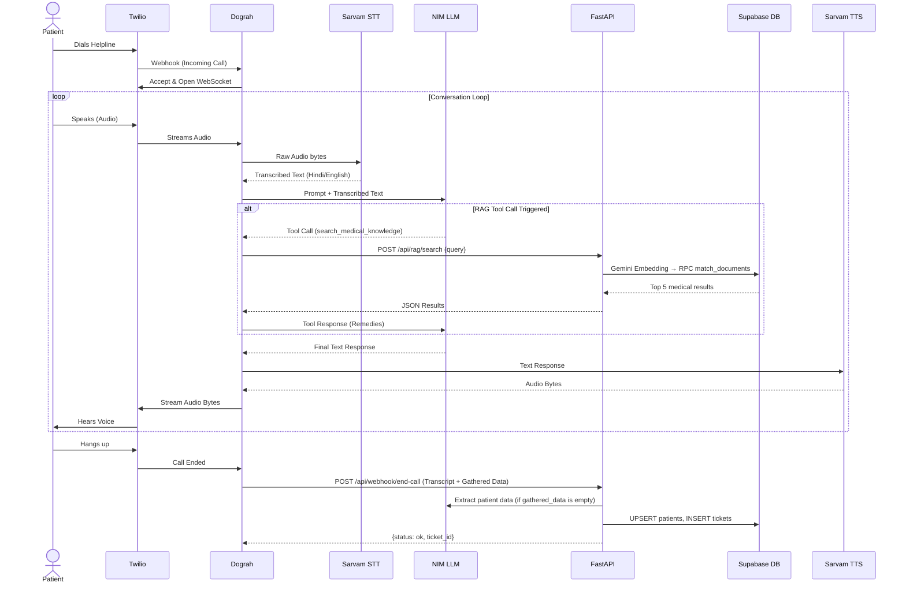
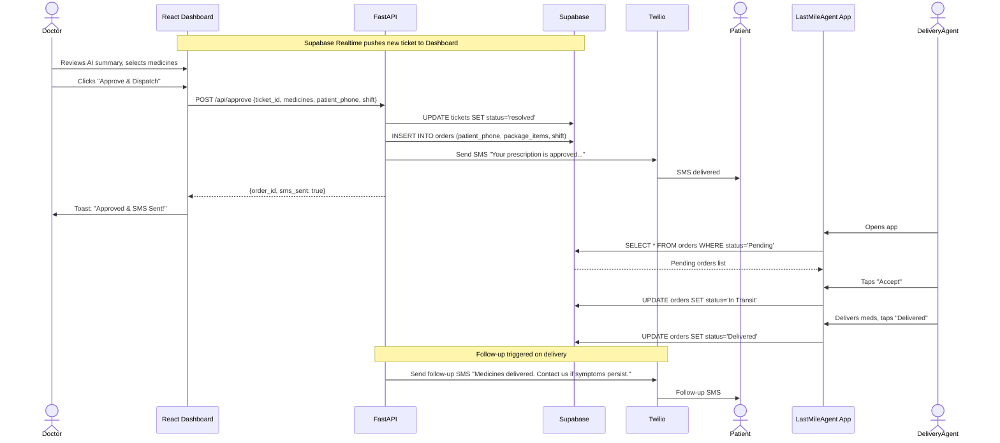

# Low-Level Design (LLD)

This document contains two detailed sequence diagrams covering the two core real-time flows in the system.

## Diagram 1: The AI Call Flow (Inbound → Triage → Ticket)

## Diagram 2: Doctor Approval → SMS → Delivery → Follow-up

