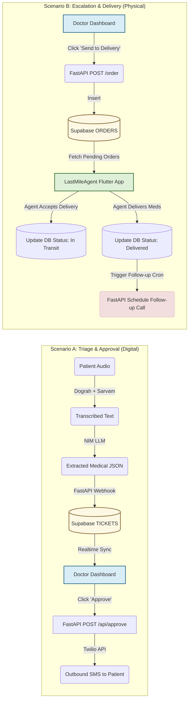

# Data Flow Diagram (Scenarios)

This diagram shows how data flows through the system in two distinct scenarios: **Scenario A (Normal Triage & Approval)** and **Scenario B (Escalation & Last Mile Delivery)**.

