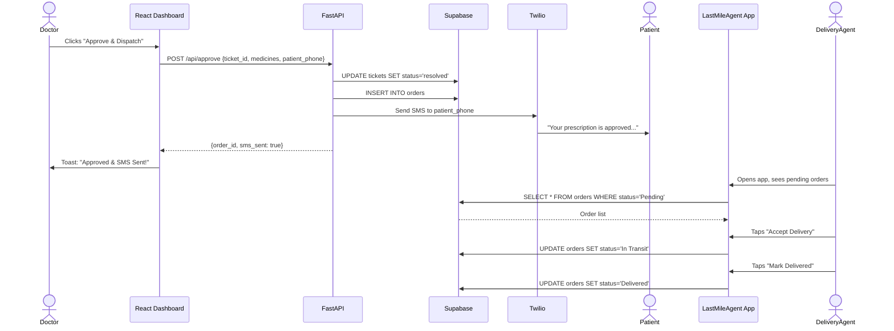

# V2 Implementation Plan — Exhaustive Technical Specification

**Timeline:** 1-2 days (hackathon) | **Budget:** ₹39 ISD | **Team:** NaN-Chalant  
**Laptop:** i7-13620H, 16GB RAM, RTX 3050, Docker Desktop installed

---

## Table of Contents
1. [Handbook: Manual Steps Outside the IDE](#1-handbook-manual-steps-outside-the-ide)
2. [Project File Structure](#2-project-file-structure-final)
3. [Database Schema](#3-database-schema)
4. [Backend: FastAPI Endpoints (Full Contract)](#4-backend-fastapi-endpoints)
5. [Backend: Services & Functions](#5-backend-services--functions)
6. [Dograh Voice Orchestration](#6-dograh-voice-orchestration)
7. [Frontend: React Dashboard Changes](#7-frontend-react-dashboard-changes)
8. [Flutter: LastMileAgent Changes](#8-flutter-lastmileagent-changes)
9. [Orchestration Sequence Diagrams](#9-orchestration-sequence-diagrams)
10. [Tests & Verification](#10-tests--verification)

---

## 1. Handbook: Manual Steps Outside the IDE

These are steps the developer must do in a browser. Complete them **before** writing any code.

### 1.1 Supabase (Database)
1. Go to https://supabase.com → Sign Up (new account if old one is paused).
2. Create a new project. Name: `curago-v2`. Region: pick closest (Mumbai if available).
3. Wait for project to provision (~2 min).
4. Go to **SQL Editor** → Paste the entire contents of `curago/setup_supabase.sql` → Click **Run**.
5. Go to **Settings → API** → Copy:
   - `Project URL` (e.g., `https://xxxxx.supabase.co`)
   - `anon public` key (starts with `eyJ...`)
6. Save these two values. You will paste them into `.env` files later.

### 1.2 NVIDIA NIM (Primary LLM)
1. Go to https://build.nvidia.com → Sign Up / Log In with NVIDIA account.
2. Browse to any model (e.g., `meta/llama-3.1-70b-instruct`).
3. Click **"Get API Key"** → Copy the key (starts with `nvapi-...`).
4. Free tier: 40 requests/minute, no credit card.

### 1.3 Groq (Fallback LLM)
1. Go to https://console.groq.com → Sign Up.
2. Go to **API Keys** → Create new key → Copy.
3. Free tier: 30 requests/minute, no credit card.

### 1.4 Sarvam AI (Indian Language STT/TTS)
1. Go to https://www.sarvam.ai → Sign Up.
2. ₹100 free credits on signup. No credit card.
3. Go to **Dashboard → API Keys** → Copy the API key.

### 1.5 Twilio (Telephony + SMS)
1. Go to https://www.twilio.com/try-twilio → Sign Up (verify with your phone).
2. You get a free **US (+1) phone number** automatically.
3. Go to **Phone Numbers → Verified Caller IDs** → Add your Indian Jio number (the one you'll call from during the demo).
4. Copy from the Console:
   - `Account SID` (starts with `AC...`)
   - `Auth Token`
   - `Twilio Phone Number` (the US number, e.g., `+1234567890`)
5. **Important:** Twilio trial SMS will prepend "Sent from your Twilio trial account" to all outbound messages. This is cosmetic only.

### 1.6 Google AI (Gemini Embeddings for RAG)
1. Go to https://aistudio.google.com/apikey → Create API Key → Copy.
2. Free tier. This is used ONLY for generating embeddings (768 dims). It has nothing to do with the NIM/Groq chat LLM.

### 1.7 Dograh (Voice Orchestrator)
1. Open PowerShell in `curago/dograh_setup/`.
2. Run:
   ```powershell
   Invoke-WebRequest -OutFile docker-compose.yaml https://raw.githubusercontent.com/dograh-hq/dograh/main/docker-compose.yaml
   Invoke-WebRequest -OutFile start_docker.ps1 https://raw.githubusercontent.com/dograh-hq/dograh/main/scripts/start_docker.ps1
   .\start_docker.ps1
   ```
3. Wait ~2-3 min for images to download. Dograh UI will be at `http://localhost:3010`.
4. In the Dograh UI:
   - Go to **Settings → Integrations**.
   - Add **Twilio** provider: paste Account SID, Auth Token, Phone Number.
   - Add **Sarvam AI** provider: paste API Key.
   - Add a **Custom OpenAI-Compatible** LLM provider:
     - Name: `nvidia-nim`
     - Base URL: `https://integrate.api.nvidia.com/v1`
     - API Key: your NIM key
     - Model: `meta/llama-3.1-70b-instruct`

### 1.8 Ngrok (Expose Local Dograh to Twilio)
1. Go to https://ngrok.com → Sign Up → Download ngrok.
2. Run: `ngrok http 3010` (or whatever port Dograh uses).
3. Copy the `https://xxxx.ngrok-free.app` URL.
4. In **Twilio Console → Phone Numbers → Your US Number → Voice Configuration**:
   - Set "A Call Comes In" → Webhook → paste ngrok URL + Dograh's inbound call path.

### 1.9 Jio ISD Pack
1. Open **MyJio App** → Recharge → ISD → Select "₹39 Global ISD Pack" (30 mins to USA).
2. This enables your phone to call the Twilio US number.

---

## 2. Project File Structure (Final)

```
curago/
├── setup_supabase.sql                 # DB schema (already created)
├── implementation_plan.md             # This file
├── .gitignore                         # [NEW] Ignore .env, node_modules, etc.
│
├── docs/                              # All architecture & planning docs
│   ├── architecture_hld.md
│   ├── architecture_lld.md
│   ├── architecture_er.md
│   ├── data_flow.md
│   ├── system_architecture_flow.md
│   └── system_architecture_mermaid.md
│
├── dograh_setup/
│   ├── docker-compose.yaml            # Downloaded from Dograh repo
│   └── start_docker.ps1               # Downloaded from Dograh repo
│
├── knowledge_base/                    # [MOVE] From hackathon_projects/knowledge_base into curago/
│   ├── Symptom2Disease.csv            # Existing Kaggle data
│   ├── Home Remedies.csv              # Existing Kaggle data
│   └── seed_db.py                     # [MODIFY] Point to new Supabase + use text-embedding-004
│
├── backend/
│   ├── .env                           # [MODIFY] New API keys
│   ├── requirements.txt               # [MODIFY] Add twilio, openai
│   └── app/
│       ├── main.py                    # [MODIFY] New router registrations
│       ├── core/
│       │   └── database.py            # [REWRITE] New Supabase URL
│       ├── services/
│       │   ├── llm.py                 # [REWRITE] NIM + Gemini embeddings
│       │   └── sms.py                 # [NEW] Twilio SMS sender
│       └── routers/
│           ├── webhook.py             # [NEW] Replaces vapi.py
│           ├── doctor.py              # [MODIFY] New column names
│           └── trainee.py             # [MODIFY] New column names
│
├── frontend/
│   ├── .env                           # [MODIFY] New Supabase URL/Key + API_BASE_URL
│   └── src/
│       ├── supabaseClient.js          # [NO CHANGE] Already reads from .env
│       └── pages/
│           ├── LoginLanding.jsx       # [MODIFY] Strip Supabase Auth
│           ├── DoctorDashboard.jsx    # [MODIFY] Use new column names, add /api/approve
│           └── TraineeDashboard.jsx   # [MODIFY] Use new column names
│
└── lastmile_agent/                    # [MOVE] From hackathon_projects/llastmileagent/llastmileagent into curago/
    ├── pubspec.yaml                   # [MODIFY] Add supabase_flutter, http
    ├── lib/
    │   ├── main.dart                  # [MODIFY] Add Supabase init
    │   ├── recentshippingscreen.dart   # [MODIFY] Replace hardcoded data with Supabase fetch
    │   ├── OrderDetailScreen.dart     # [MODIFY] Call FastAPI for status updates
    │   ├── Signin.dart
    │   ├── PaymentScreen.dart
    │   ├── PaymentSuccessScreen.dart
    │   ├── UpiQrScreen.dart
    │   └── MapScreen.dart
    ├── android/
    ├── ios/
    └── web/
```

---

## 3. Database Schema

Already finalized in `setup_supabase.sql`. Tables: `patients`, `tickets`, `orders`, `inventory`, `camps`, `knowledge_base`. See `architecture_er.md` for the ER diagram.

**Key Column Name Mapping (V1 → V2):**

| V1 Column (camelCase) | V2 Column (snake_case) | Table |
|---|---|---|
| `patientId` | `id` (UUID PK) | patients |
| `phoneNumber` | `phone_number` | patients |
| `villageCreatedId` | (removed) | patients |
| `ticketId` | `id` (UUID PK) | tickets |
| `patientId` | `patient_id` | tickets |
| `ticketStatus` | `status` | tickets |
| `severityScore` | `severity` | tickets |
| `symptomsSummary` | `symptoms_summary` | tickets |
| `assignedTraineeId` | `assigned_trainee_id` | tickets |
| `vitalsData` | `vitals_data` | tickets |
| `centerId` | `center_id` | inventory |

This mapping is critical for the implementing model. Every Supabase `.eq("camelCase", ...)` call in V1 must be changed to `.eq("snake_case", ...)`.

---

## 4. Backend: FastAPI Endpoints

### 4.1 `POST /api/webhook/end-call`
**Called by:** Dograh (end-of-call webhook)  
**Purpose:** Receives the call transcript, extracts patient data via NIM, creates patient + ticket in DB.

```
Request Body (from Dograh):
{
  "call_id": "{{workflow_run_id}}",
  "caller_number": "{{initial_context.caller_number}}",
  "transcript": "{{transcript_url}}" or raw text,
  "gathered_data": {
    "patient_name": "{{gathered_context.patient_name}}",
    "symptoms": "{{gathered_context.symptoms}}",
    "severity": "{{gathered_context.severity}}",
    "age": "{{gathered_context.age}}",
    "gender": "{{gathered_context.gender}}",
    "village": "{{gathered_context.village}}"
  }
}

Response: { "status": "ok", "ticket_id": "<uuid>" }
```

**Logic:**
1. Read `gathered_data` from payload. If Dograh extracted structured data, use it directly.
2. If `gathered_data` is empty/missing, fall back to calling NIM to extract from raw transcript (same pattern as V1's `vapi.py` lines 65-81, but using OpenAI SDK instead of Gemini).
3. Upsert patient: check `patients` table by `phone_number`. If exists, update name. If not, insert new row.
4. Insert into `tickets`: `patient_id`, `symptoms_summary`, `severity`, `status='open'`.
5. Return `ticket_id`.

---

### 4.2 `POST /api/rag/search`
**Called by:** Dograh (mid-call tool/function call)  
**Purpose:** Searches the medical knowledge base via vector similarity.

```
Request Body:
{ "query": "fever and red spots on skin" }

Response:
{
  "results": [
    { "content": "To treat or manage Chickenpox, a recommended home remedy is...", "similarity": 0.82 },
    { "content": "Symptoms of Measles include...", "similarity": 0.76 }
  ]
}
```

**Logic:**
1. Receive `query` string.
2. Prepend: `"Home remedy and treatment for {query}"` (same trick from V1 `llm.py` line 33).
3. Call Gemini `text-embedding-004` to convert to 768-dim vector.
4. Call Supabase RPC `match_documents(vector, 0.4, 5)`.
5. Return top 5 results.

---

### 4.3 `POST /api/approve`
**Called by:** React Dashboard (Doctor clicks "Approve & Dispatch Order")  
**Purpose:** Resolves the ticket, creates a delivery order, and sends SMS to patient.

```
Request Body:
{
  "ticket_id": "<uuid>",
  "medicines": [{"name": "Paracetamol 500mg", "quantity": "x2"}, ...],
  "patient_phone": "+91xxxxxxxxxx",
  "patient_name": "Rajesh Kumar",
  "delivery_address": "House #42, Near Banyan Tree, Rampur Village",
  "shift": "Morning"
}

Response: { "status": "ok", "order_id": "<uuid>", "sms_sent": true }
```

**Logic:**
1. Update `tickets` table: set `status = 'resolved'` where `id = ticket_id`.
2. Insert into `orders`: `ticket_id`, `patient_phone`, `patient_name`, `package_items` (the medicines array), `delivery_address`, `shift`, `status = 'Pending'`.
3. Call Twilio SMS API: send message to `patient_phone` saying "Your prescription has been approved. Medicines: {list}. Delivery scheduled for {shift} slot."
4. Return `order_id` and `sms_sent` status.

---

### 4.4 `GET /api/tickets`
**Called by:** React Dashboard (DoctorDashboard, TraineeDashboard)  
**Purpose:** Fetch all tickets with joined patient data.

```
Response: [
  {
    "id": "<uuid>",
    "patient_id": "<uuid>",
    "status": "open",
    "severity": "high",
    "symptoms_summary": "Persistent fever, body aches...",
    "patients": { "name": "Rajesh", "phone_number": "+91...", "village": "Rampur" }
  }, ...
]
```

**Logic:** `supabase.table("tickets").select("*, patients(*)").execute()`

---

### 4.5 `GET /api/orders`
**Called by:** Flutter LastMileAgent app  
**Purpose:** Fetch delivery orders, filterable by status and shift.

```
Query Params: ?status=Pending&shift=Morning
Response: [
  {
    "id": "<uuid>",
    "patient_name": "Rajesh Kumar",
    "patient_phone": "+91...",
    "package_items": [{"name": "Paracetamol", "quantity": "x2"}],
    "delivery_address": "House #42...",
    "status": "Pending",
    "shift": "Morning"
  }, ...
]
```

---

### 4.6 `PATCH /api/orders/{order_id}/status`
**Called by:** Flutter LastMileAgent app  
**Purpose:** Delivery agent updates order status.

```
Request Body: { "status": "In Transit" }   OR   { "status": "Delivered" }
Response: { "status": "ok" }
```

**Logic:**
1. Update `orders` table: set `status` where `id = order_id`.
2. Fetch `patient_phone` and `patient_name` from the updated order row.
3. If new status is `"Delivered"`, send a follow-up SMS via Twilio: "Hi {patient_name}, your medicines have been delivered. If symptoms persist after 3 days, our system will check in with you."

---

### 4.7 `GET /api/inventory`
**Called by:** React Dashboard (medicine search dropdown)

```
Response: [
  { "id": "<uuid>", "medicine_name": "Paracetamol 500mg", "stock": 150, "unit": "tablets", "type": "normal", "center_id": "L1_Village" },
  ...
]
```

---

### 4.8 `GET /api/camps`
**Called by:** React Dashboard (Specialist Camp Escalation section)

```
Response: [
  { "id": "<uuid>", "name": "Eye Care Camp", "specialty": "eye", "date": "Sun, 1 Mar", "max_capacity": 50, "booked_count": 12 },
  ...
]
```

---

### 4.9 `POST /api/escalate`
**Called by:** React Dashboard (Send to Specialist Camp Pool button)

```
Request Body: { "ticket_id": "<uuid>", "camp_id": "<uuid>" }
Response: { "status": "ok" }
```

**Logic:**
1. Update `tickets`: set `status = 'escalated'`, `camp_id = camp_id`.
2. Update `camps`: increment `booked_count` by 1.

---

## 5. Backend: Services & Functions

### 5.1 `backend/app/core/database.py` (REWRITE)

```python
# Just the Supabase client. Reads URL and Key from .env.
import os
from supabase import create_client, Client
from dotenv import load_dotenv

load_dotenv()
SUPABASE_URL = os.getenv("SUPABASE_URL")
SUPABASE_KEY = os.getenv("SUPABASE_KEY")
supabase: Client = create_client(SUPABASE_URL, SUPABASE_KEY)
```

### 5.2 `backend/app/services/llm.py` (REWRITE)

Two responsibilities:
1. **`get_embedding(text) -> list[float]`**: Calls Gemini `text-embedding-004`. Returns 768-dim vector.
2. **`search_medical_knowledge(query) -> str`**: Prepends remedy-biased prefix, gets embedding, calls Supabase RPC `match_documents`, returns concatenated results.
3. **`extract_patient_data(transcript) -> dict`**: Calls NVIDIA NIM (`meta/llama-3.1-70b-instruct`) via OpenAI SDK to extract `{name, severity, symptoms, age, gender, village}` from raw transcript. Falls back to Groq if NIM returns 429.

**Key implementation detail for NIM/Groq fallback:**
```python
from openai import OpenAI

nim_client = OpenAI(base_url="https://integrate.api.nvidia.com/v1", api_key=NIM_KEY)
groq_client = OpenAI(base_url="https://api.groq.com/openai/v1", api_key=GROQ_KEY)

def extract_patient_data(transcript: str) -> dict:
    prompt = [{"role": "system", "content": "Extract..."}, {"role": "user", "content": transcript}]
    try:
        response = nim_client.chat.completions.create(model="meta/llama-3.1-70b-instruct", messages=prompt)
    except Exception:
        response = groq_client.chat.completions.create(model="llama-3.1-70b-versatile", messages=prompt)
    return parse_response(response)
```

### 5.3 `backend/app/services/sms.py` (NEW)

```python
from twilio.rest import Client
import os

def send_sms(to: str, body: str):
    client = Client(os.getenv("TWILIO_ACCOUNT_SID"), os.getenv("TWILIO_AUTH_TOKEN"))
    client.messages.create(
        body=body,
        from_=os.getenv("TWILIO_PHONE_NUMBER"),
        to=to
    )
```

### 5.4 `backend/.env` (MODIFY)
```
SUPABASE_URL=https://xxxxx.supabase.co
SUPABASE_KEY=eyJ...
GEMINI_API_KEY=AIza...
NVIDIA_NIM_API_KEY=nvapi-...
GROQ_API_KEY=gsk_...
TWILIO_ACCOUNT_SID=AC...
TWILIO_AUTH_TOKEN=...
TWILIO_PHONE_NUMBER=+1...
```

### 5.5 `backend/requirements.txt` (MODIFY)
```
fastapi
uvicorn
supabase
python-dotenv
pydantic
httpx
google-generativeai
openai
twilio
```

### 5.6 `backend/app/main.py` (MODIFY)
```python
from app.routers import doctor, trainee, webhook

app.include_router(webhook.router, prefix="/api/webhook", tags=["Webhook"])
app.include_router(doctor.router, prefix="/api", tags=["Doctor"])
app.include_router(trainee.router, prefix="/api/trainee", tags=["Trainee"])
```
Note: `vapi.py` router is removed. Replaced by `webhook.py`.

---

## 6. Dograh Voice Orchestration

### 6.1 Agent System Prompt
Paste this exact text into Dograh's Agent configuration:

```
You are a telemedicine health agent for a rural healthcare system in India. Your name is Curago.

Your job:
1. Greet the patient warmly in whatever language they speak.
2. Ask about their symptoms, how long they've had them, and their severity.
3. Ask for their name, age, gender, and village.
4. Use the search_medical_knowledge tool to find relevant medical guidelines.
5. Share home remedies and basic advice based ONLY on the search results.
6. Classify the severity as High, Medium, or Low.
7. If High severity, tell the patient a doctor will call them back urgently.
8. End by summarizing what you discussed.

Rules:
- ALWAYS speak in the same language the patient uses.
- NEVER diagnose. Only share guidelines from the database.
- Keep responses short (2-3 sentences). This is a phone call, not a chat.
- If you cannot find information, say "I will note this and have a doctor review your case."
```

### 6.2 Tool/Function Definition
In Dograh's Agent config, add this function definition so the LLM can call your backend mid-conversation:

```json
{
  "name": "search_medical_knowledge",
  "description": "Search the medical knowledge base for symptoms, remedies, and treatment guidelines. Call this when the patient describes symptoms.",
  "parameters": {
    "type": "object",
    "properties": {
      "query": {
        "type": "string",
        "description": "The patient's symptoms or health concern, e.g. 'fever and headache for 3 days'"
      }
    },
    "required": ["query"]
  }
}
```

**Tool Server URL:** `http://host.docker.internal:8000/api/rag/search`

### 6.3 End-of-Call Webhook
In Dograh's workflow, add a **Webhook Node** at the end:
- **URL:** `http://host.docker.internal:8000/api/webhook/end-call`
- **Method:** POST
- **Payload:**
```json
{
  "call_id": "{{workflow_run_id}}",
  "caller_number": "{{initial_context.caller_number}}",
  "transcript": "{{transcript_url}}",
  "gathered_data": {
    "patient_name": "{{gathered_context.patient_name}}",
    "symptoms": "{{gathered_context.symptoms}}",
    "severity": "{{gathered_context.severity}}"
  }
}
```

### 6.4 Provider Stack in Dograh UI
| Slot | Provider | Model/Config |
|---|---|---|
| STT | Sarvam AI | Saarika (auto-detect language) |
| LLM | Custom OpenAI-compatible | Base URL: `https://integrate.api.nvidia.com/v1`, Model: `meta/llama-3.1-70b-instruct` |
| TTS | Sarvam AI | Bulbul (auto-match language) |
| Telephony | Twilio | Account SID + Auth Token + Phone Number |

---

## 7. Frontend: React Dashboard Changes

### 7.1 `frontend/.env`
```
VITE_SUPABASE_URL=https://xxxxx.supabase.co
VITE_SUPABASE_ANON_KEY=eyJ...
VITE_API_BASE_URL=http://localhost:8000
```

### 7.2 `frontend/src/supabaseClient.js`
**NO CHANGE NEEDED.** It already reads `VITE_SUPABASE_URL` and `VITE_SUPABASE_ANON_KEY` from `.env`.

### 7.3 `frontend/src/pages/LoginLanding.jsx`
**CHANGE:** Remove `supabase.auth.signInWithPassword()` call. Replace with a simple local credential check:
```javascript
const onLogin = async (e) => {
  e.preventDefault();
  if (email === 'doctor@hospital.com' && password === 'Doctor123') {
    navigate('/doctor');
  } else if (email === 'trainee@hospital.com' && password === 'Trainee123') {
    navigate('/trainee');
  } else {
    setError('Invalid credentials');
  }
};
```
Remove: `import { supabase } from '../supabaseClient'` from this file.

### 7.4 `frontend/src/pages/DoctorDashboard.jsx`
**Column name changes (find-and-replace across the file):**

| Find | Replace With |
|---|---|
| `patientId` | `patient_id` |
| `ticketStatus` | `status` |
| `severityScore` | `severity` |
| `symptomsSummary` | `symptoms_summary` |
| `assignedTraineeId` | `assigned_trainee_id` |
| `vitalsData` | `vitals_data` |
| `ticketId` | `id` |
| `phoneNumber` | `phone_number` |

**Approve button handler change:**
Replace the current `handleApproveReport` function (which does direct Supabase updates) with:
```javascript
const handleApproveReport = async () => {
  const res = await fetch(`${import.meta.env.VITE_API_BASE_URL}/api/approve`, {
    method: 'POST',
    headers: { 'Content-Type': 'application/json' },
    body: JSON.stringify({
      ticket_id: selectedReportId,
      medicines: prescriptions[selectedReportId],
      patient_phone: selectedReport.patients?.phone_number,
      patient_name: selectedReport.patients?.name,
      delivery_address: selectedReport.patients?.village,
      shift: "Morning"
    })
  });
  if (res.ok) addToast('Prescription approved & SMS sent!');
};
```

**Ticket fetch change:**
Replace `.from('tickets').select('*')` with `.from('tickets').select('*, patients(*)')` to get joined patient data in one call.

### 7.5 `frontend/src/pages/TraineeDashboard.jsx`
Apply the same column name find-and-replace as DoctorDashboard.

---

## 8. Flutter: LastMileAgent Changes

### 8.1 `pubspec.yaml`
Add dependency:
```yaml
dependencies:
  supabase_flutter: ^2.0.0
```

### 8.2 `lib/main.dart`
Add Supabase init:
```dart
import 'package:supabase_flutter/supabase_flutter.dart';

void main() async {
  WidgetsFlutterBinding.ensureInitialized();
  await Supabase.initialize(
    url: 'https://xxxxx.supabase.co',
    anonKey: 'eyJ...',
  );
  runApp(MyApp());
}
```

### 8.3 `lib/recentshippingscreen.dart`
Replace the hardcoded `orders` list (lines 18-86) with a Supabase fetch:
```dart
final supabase = Supabase.instance.client;

Future<List<Map<String, dynamic>>> fetchOrders(String shift) async {
  final response = await supabase
    .from('orders')
    .select()
    .eq('shift', shift)
    .order('created_at', ascending: false);
  return List<Map<String, dynamic>>.from(response);
}
```

### 8.4 `lib/OrderDetailScreen.dart`
**CHANGE:** The app MUST call the FastAPI backend to update status so the Twilio SMS triggers. DO NOT update Supabase directly.

```dart
import 'package:http/http.dart' as http;

// Note: Use your laptop's local IP (e.g., 192.168.x.x) if running on a physical phone or emulator.
// Localhost will point to the phone itself and fail.
const backendUrl = 'http://192.168.X.X:8000';

Future<void> updateOrderStatus(String orderId, String newStatus) async {
  await http.patch(
    Uri.parse('$backendUrl/api/orders/$orderId/status'),
    headers: {'Content-Type': 'application/json'},
    body: '{"status": "$newStatus"}'
  );
}
```

---

## 9. Orchestration Sequence Diagrams

### 9.1 Scenario A: Inbound Call → Ticket Creation
(Already documented in `architecture_lld.md`)

### 9.2 Scenario B: Doctor Approval → SMS + Delivery



---

## 10. Tests & Verification

### 10.1 Backend Smoke Tests (run after backend is up)

```bash
# Test 1: Health check
curl http://localhost:8000/
# Expected: {"message": "Telemedicine API is running!"}

# Test 2: RAG search
curl -X POST http://localhost:8000/api/rag/search \
  -H "Content-Type: application/json" \
  -d '{"query": "fever and headache"}'
# Expected: {"results": [{"content": "...", "similarity": 0.7}, ...]}

# Test 3: Create a test ticket via webhook
curl -X POST http://localhost:8000/api/webhook/end-call \
  -H "Content-Type: application/json" \
  -d '{"call_id":"test-001","caller_number":"+919999999999","transcript":"","gathered_data":{"patient_name":"Test Patient","symptoms":"fever","severity":"Medium"}}'
# Expected: {"status": "ok", "ticket_id": "<uuid>"}

# Test 4: Fetch tickets
curl http://localhost:8000/api/tickets
# Expected: Array with the test ticket

# Test 5: Approve (will send real SMS if Twilio is configured!)
curl -X POST http://localhost:8000/api/approve \
  -H "Content-Type: application/json" \
  -d '{"ticket_id":"<uuid-from-test-3>","medicines":[{"name":"Paracetamol","quantity":"x2"}],"patient_phone":"+91YOUR_NUMBER","patient_name":"Test Patient","delivery_address":"Test Village","shift":"Morning"}'
# Expected: {"status": "ok", "order_id": "<uuid>", "sms_sent": true}
```

### 10.2 Frontend Verification
1. `cd frontend && npm run dev`
2. Open `http://localhost:5173`
3. Login with `doctor@hospital.com / Doctor123`
4. Verify: tickets from Test 3 appear in the dashboard.
5. Click "Approve" → verify SMS arrives on your phone.

### 10.3 End-to-End Voice Test
1. Ensure Dograh Docker is running (`http://localhost:3010`).
2. Ensure ngrok is running and URL is configured in Twilio.
3. Call the Twilio US number from your Jio phone (with ₹39 ISD pack).
4. Speak in Hindi. Verify the AI responds in Hindi.
5. After hanging up, check the Doctor Dashboard — a new ticket should appear within 5 seconds.
