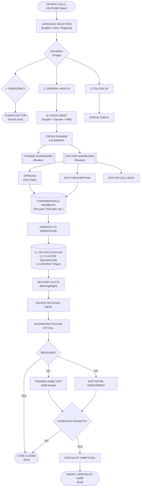

# System Architecture Mermaid Flowchart (Shapes Only, No Color)

Here is the flowchart using only different shapes to differentiate the types of steps (Start/End, Process, Decision, System/Module). You can copy-paste this into GitHub, Notion, or any Markdown viewer.

